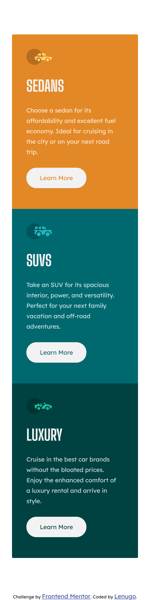
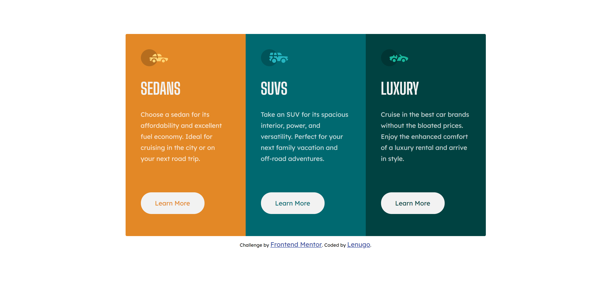

# Frontend Mentor - 3-column preview card component solution

This is a solution to the [3-column preview card component challenge on Frontend Mentor](https://www.frontendmentor.io/challenges/3column-preview-card-component-pH92eAR2-).

## Table of contents

-   [Overview](#overview)
    -   [The challenge](#the-challenge)
    -   [Screenshot](#screenshot)
    -   [Links](#links)
-   [My process](#my-process)
    -   [Built with](#built-with)
    -   [What I learned](#what-i-learned)
    -   [Continued development](#continued-development)
-   [Author](#author)

## Overview

### The challenge

Users should be able to:

-   View the optimal layout depending on their device's screen size

### Screenshot

## Mobile

## Desktop

### Links

-   Solution URL: [Add solution URL here](https://your-solution-url.com)
-   Live Site URL: [live site with URL](https://lenugo.github.io/3-column-card/)

## My process

### Built with

-   Semantic HTML5 markup
-   CSS custom properties
-   Flexbox
-   Mobile-first workflow

# Author

-   Github User - [Lenugo](https://www.github.com/Lenugo)
-   Frontend Mentor User - [Frontend Mentor](https://www.frontendmentor.io/profile/L24N97)
